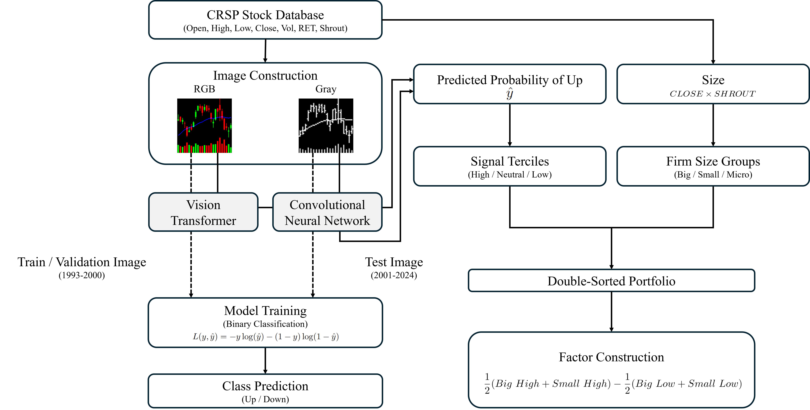

# From vision to value: Stock chart image-driven factors and their pricing power

<p align="center">
  
</p>

## Overview

A deep learning framework for constructing stock chart image–driven factors and testing their pricing power in asset markets.

Key features:

-Stock charts can reveal hidden signals that matter for asset pricing

-Deep learning uncovers priced factors from stock chart images

-Vision Transformer delivers robust return spreads and superior risk-adjusted performance

-Convolutional Neural Network factor shows weak pricing relevance

-Double-selection LASSO validates chart-driven signals as priced risks

## Project Structure
```
vit-sdf-lasso/
├── requirements.txt                                   # Python dependencies
├── 1.data_preprocess.ipynb                            # CRSP daily stock data download, filter common stocks
├── 2.sorting_portfolio.ipynb                          # Construct 3×3 (size × signal) portfolios using ViT/CNN signals, monthly rebalancing, value-weighted H−L spreads
├── 3.portfolio_performance.ipynb                      # Compute cumulative/log returns, Sharpe/Sortino/MDD, and generate performance summary tables
├── 4.sdf_multicpu.py                                  # Run double-selection LASSO with cross-validation in parallel (joblib), seed replications, exponential λ grid, 
├── 5.sdf_loading.ipynb                                # Estimate SDF loading for the ViT/CNN factor (post double-selection OLS), report coefficient & t-statistics, sensitivity analysis 
├── 6.visualize.ipynb                                  # SDF loading heatmaps
├── 7.appendix_visualize.ipynb                         # Control Selection & Robustness visualize
```

## Useage
Run the notebooks in the following order:

1. Run 1.data_preprocess.ipynb
2. Run 2.sorting_portfolio.ipynb
3. Run 3.portfolio_performance.ipynb
4. Run 4.sdf_multicpu.py
5. Run 5.sdf_loading.ipynb
6. Run 6.visualize.ipynb
7. Run 7.appendix_visualize.ipynb

Note: Data will be made available upon request. Please contact jybyun@hanyang.ac.kr for your request.

                                           
