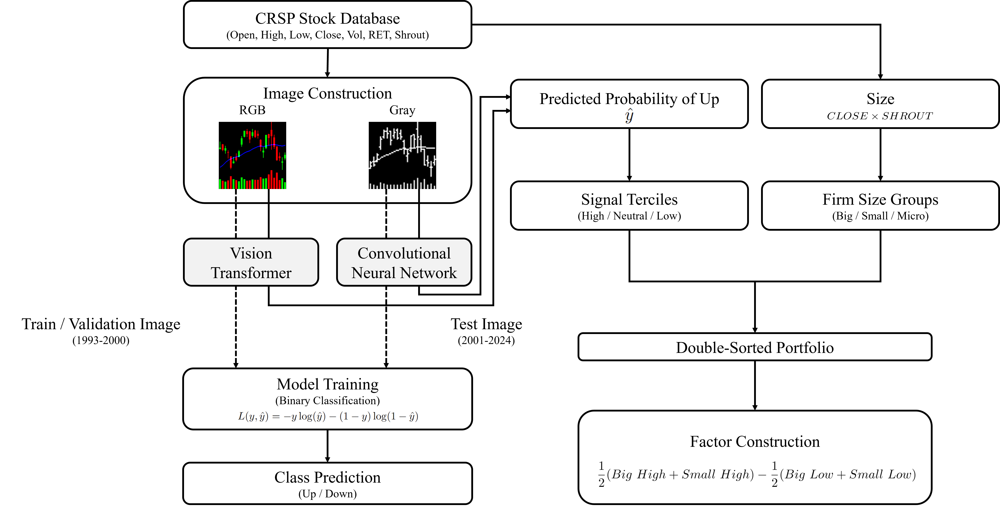

# From vision to value: Stock chart image-driven factors and their pricing power

<p align="center">
  
</p>

## Overview

A deep learning framework for constructing stock chart image–driven factors and testing their pricing power in asset markets.

## Project Structure
```
vit-sdf-lasso/
├── image_generation/          # Stock chart image generation
│   ├── data_preprocess.py     # CRSP data preprocessing
│   ├── gray_image_cnn_xiu.py  # Grayscale images for CNN (Jiang et al., 2023)
│   └── rgb_image_vit_byun.py  # RGB images for ViT (Byun et al., 2025)
│
├── models/                    # Pre-trained models and inference
│   ├── weights/               # Model weights (5 seeds each)
│   │   ├── cnn/
│   │   └── vit/
│   └── inference.py           # Generate predictions from images
│
├── sdf_analysis/              # SDF analysis pipeline
│   ├── data_preprocess.py     # Prepare CRSP data for portfolio construction
│   ├── sorting_portfolio.py   # Construct 3×3 size-signal sorted portfolios
│   ├── portfolio_performance.ipynb  # Performance metrics (Sharpe, MDD, etc.)
│   ├── univariate_beta_scaling.py   # Compute factor betas for penalty weights
│   ├── double_lasso_selection.py    # Double-selection LASSO with CV
│   ├── sdf_loading.ipynb      # Estimate SDF loadings (post-LASSO OLS)
│   ├── visualize.ipynb        # t-SNE and heatmap figures
│   └── appendix_visualize.ipynb     # Robustness check figures
│
├── figure/                    
├── requirements.txt
└── README.md

## Usage

### 1. Image Generation

Generate stock chart images from CRSP daily data.
```bash
cd image_generation
python data_preprocess.py        # Preprocess CRSP data → saves to data/stock/
python rgb_image_vit_byun.py     # Generate 224×224 RGB candlestick images for ViT
python gray_image_cnn_xiu.py     # Generate 64×60 grayscale images for CNN
```

### 2. Model Inference

Generate return predictions using pre-trained models (5-seed ensemble).
```bash
cd models
# Edit inference.py:
#   - MODEL_TYPE: 'vit' or 'cnn'
#   - IMAGE_DIR: path to your generated images
python inference.py
```

Output: CSV files with prediction probabilities (`pred1`–`pred5` and `pred_mean`).

### 3. SDF Analysis

Construct factors and test their pricing power via double-selection LASSO.
```bash
cd sdf_analysis

# Step 1: Prepare data
python data_preprocess.py

# Step 2: Construct sorted portfolios (3×3 size × signal)
python sorting_portfolio.py

# Step 3: Compute univariate betas for penalty weights
python univariate_beta_scaling.py

# Step 4: Run double-selection LASSO (parallelized, 200 seeds)
python double_lasso_selection.py

# Step 5: Estimate SDF loadings and robustness checks
# Open and run: sdf_loading.ipynb

# Step 6: Generate figures
# Open and run: visualize.ipynb, appendix_visualize.ipynb
```

Note: Data will be made available upon request. Please contact jybyun@hanyang.ac.kr for your request.

                                           
